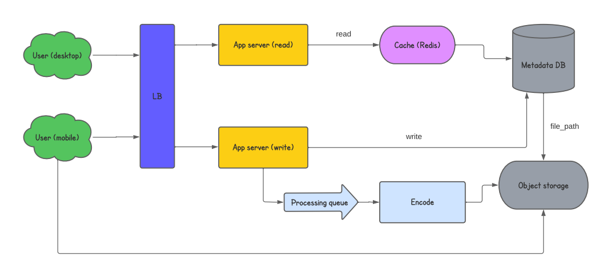

# System Design Collection

Author: Mukhammadjon Sirojiddinov

Note: Collection of resources to learn system design and web architecture

  
   

## Preparation for system design interview in FAANG companies

System design interviews are common and required in may tech companies. You are evaluated on how you handle architectural and design issues. Interviewee is evaluated based on his or her problem-solving and communication skills. That's why I have created this repository to collect and share resources to learn System design. You are welcome to contribute and give some suggestions.

### Additional resources

* Alex Xu, **System Design Interview: An insider's guide**, [System Design Interview – An insider's guide](https://www.amazon.com/System-Design-Interview-insiders-Second/dp/B08CMF2CQF/ref=sr_1_2?keywords=system+design+interview&qid=1649882341&sprefix=system+de%2Caps%2C262&sr=8-2)

* Donne Martin, **The System Design Primer** [The System Design Primer](https://github.com/donnemartin/system-design-primer)

## What is system design ?
According to Wikipedia, Systems design is the process of defining the architecture, product design, modules, interfaces, and data for a system to satisfy specified requirements. Systems design could be seen as the application of systems theory to product development. There is some overlap with the disciplines of systems analysis, systems architecture and systems engineering. [Wikipedia - System design](https://en.wikipedia.org/wiki/Systems_design)